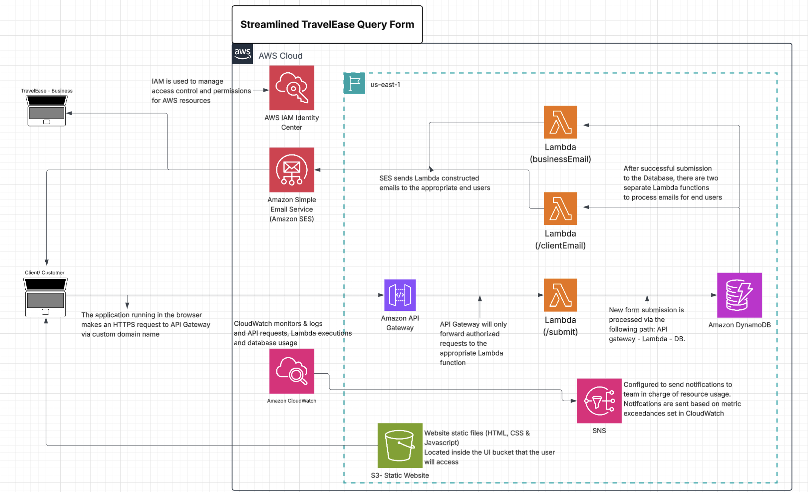

# TravelEase: AI-Powered Serverless Contact Form

A production-ready serverless contact form that captures customer travel 
inquiries, generates AI-powered insights using the Claude API, and 
automates email delivery — all on AWS managed services with zero 
server management.

📄 View the [Full Technical Documentation →](https://medium.com/@dehanbekker23/travelease-ai-powered-serverless-contact-form-539cc2823496) for the complete SDLC breakdown

---

## The Problem

TravelEase was losing customer inquiries through unreliable mailto: links 
with no confirmation, no tracking, and no way to prioritize leads. 
The business needed a reliable, cost-effective system that could scale 
with seasonal traffic spikes — without hiring a dedicated ops team.

---

## What I Built



A fully serverless contact form backed by AWS that:

- **Captures** customer travel inquiries via a CloudFront-hosted web form
- **Validates** submissions server-side in Lambda before touching any 
  downstream service
- **Generates AI insights** using the Anthropic Claude API to help 
  TravelEase employees understand customer intent before responding
- **Persists** every submission with a unique ID and timestamp to DynamoDB
- **Delivers** automated email confirmations to both the customer and the 
  business via Amazon SES
- **Monitors** backend health in real time using CloudWatch Alarms and SNS

---

## User Experience

1. Customer visits the HTTPS-enabled CloudFront URL
2. Fills out name, email and travel plans — submits the form
3. Sees a success confirmation with a reference ID within ~3 seconds
4. Receives an automated email confirmation from TravelEase

**TravelEase employees receive:**
- A detailed email notification containing the customer inquiry
- AI-generated travel insights from Claude — summarizing customer intent, 
  suggesting relevant packages, and flagging high-value leads
- This eliminates manual research and helps staff respond faster and 
  with more context

---

## Business Value

| Metric | Result |
|---|---|
| Response time | Sub-3 seconds including AI processing |
| Operational cost | ~$0.50/month at 100 submissions |
| Infrastructure overhead | Zero — 100% AWS managed services |
| Lead prioritization | AI insights on every submission |
| Availability | 99.9% via AWS managed services |

---

## Technologies Used

**AWS Services**
- S3 — Static website hosting
- CloudFront — CDN with HTTPS/TLS 1.2
- API Gateway — REST API with rate limiting and API key authentication
- Lambda — Python 3.12 serverless compute
- DynamoDB — NoSQL database with point-in-time recovery
- SES — Transactional email delivery
- Secrets Manager — Secure API key storage
- CloudWatch — Logging, metrics and alarms
- SNS — Real-time alert notifications
- IAM — Least privilege access control

**IaC and DevOps**
- Terraform — 100% infrastructure as code
- GitHub Actions — CI/CD pipeline with OIDC authentication
- Git — Three-tier branching strategy (feature → development → main)

**External**
- Anthropic Claude API (Sonnet model) — AI-powered travel insights

---

## Key Accomplishments

✅ **Serverless architecture** — Zero EC2 instances or containers to manage

✅ **AI integration** — Claude API generates travel insights on every 
   submission, helping TravelEase staff prioritize and respond faster

✅ **Defense in depth** — HTTPS, API key auth, server-side validation, 
   least privilege IAM, secrets management — security at every layer

✅ **CI/CD pipeline** — GitHub Actions with OIDC authentication; no 
   static credentials stored anywhere

✅ **Human in the loop** — Terraform plan output visible on every Pull 
   Request; apply only runs after human approval and merge to main

✅ **Active monitoring** — Four CloudWatch alarms notify the engineering 
   team via SNS before issues reach customers

✅ **Infrastructure as Code** — Entire stack reproducible from a single 
   terraform apply

---

## CI/CD Pipeline

Rather than static AWS Access Keys, OIDC authentication establishes a 
federated trust relationship between GitHub and AWS. Short-lived 
credentials are issued per workflow run — nothing stored long-term.

**Two dedicated workflows:**
- `backend.yml` — Runs Terraform plan on Pull Request, apply on merge 
  to main. Triggers only on infrastructure/ or lambda/ changes.
- `frontend.yml` — Syncs frontend files to S3 on merge to main. 
  Triggers only on frontend/ changes.

**Branching strategy:**
```
feature branch (local) → development → Pull Request → main → deploys to AWS
```

---

## Deployment

**Prerequisites:** AWS CLI, Terraform, configured AWS credentials
```bash
# Bootstrap OIDC and GitHub Actions IAM Role (one-time)
cd infrastructure/
terraform init
terraform apply

# All subsequent changes deploy via GitHub Actions pipeline
git checkout -b feature/your-change
# make changes
git add .
git commit -m "Your change"
git checkout development
git merge feature/your-change
git push origin development
# Open Pull Request → review plan → merge to main → auto deploys
```

**Teardown:**
```bash
terraform destroy
aws secretsmanager delete-secret \
  --secret-id travelease/claude-api-key \
  --force-delete-without-recovery
```

---

## Repository Structure
```
travelease-contact/
├── .github/
│   └── workflows/
│       ├── backend.yml
│       └── frontend.yml
├── frontend/
│   ├── index.html
│   ├── styles.css
│   └── script.js
├── infrastructure/
│   ├── main.tf
│   ├── variables.tf
│   ├── backend.tf
│   └── lambda/
│       └── index.py
└── README.md
```

---

## What This Demonstrates

**Cloud Architecture**
- Serverless design with AWS managed services
- Defense in depth security across every layer
- Cost-optimised pay-per-use infrastructure

**DevOps and IaC**
- Production-grade CI/CD with OIDC authentication
- Human-in-the-loop deployment gates
- Terraform state management with remote S3 backend

**AI Integration**
- Third-party API integration within a serverless workflow
- Prompt engineering for business-relevant insights
- Cost-aware token management

---

## 🤝 Let's Connect!

[](https://www.linkedin.com/in/dehan-bekker)
[](https://github.com/iac23)
[](https://medium.com/@dehanbekker23/travelease-ai-powered-serverless-contact-form-539cc2823496)